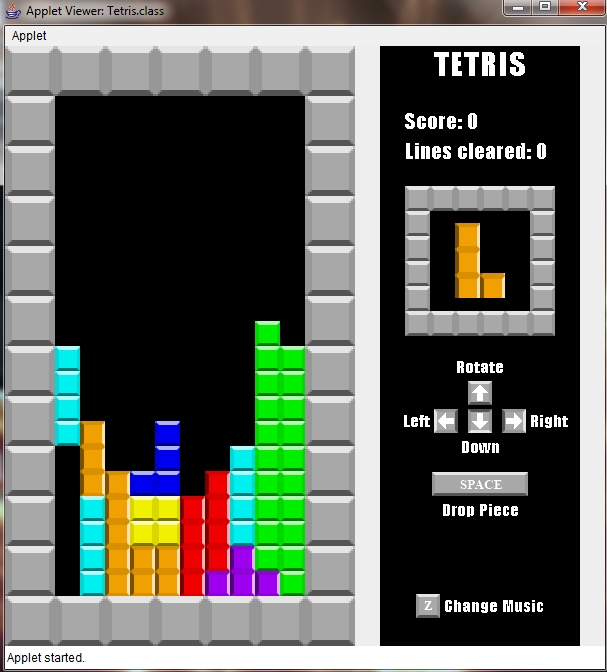

Name: Joseph Morris
Project #4, Tetris
Date: 12-16-10

# Note: 
This code has not been edited or maintained since it was written. It serves as an early example of my explorations in coding.

# Description:
This game, Tetris, is an exercise in the manipulation of simple graphics, arrays, and input listeners.The game starts out at a slow pace, but then as the user gets a tetris (or passes twenty lines cleared) the speed increases to make the game more challenging. It features three songs for the user to listen to while playing. The game ends when a piece cannot be generated on the board.

# Instructions:

THIS APPLET MUST BE RUN USING FROM A COMMAND LINE OR TERMINAL USING THE FOLLOWING COMMAND: appletviewer Tetris.html

THE PROGRAM WILL NOT FUNCTION IN A NORMAL BROWSER DUE TO COMPATIBILITY ISSUES!!!!

# Included Files and INSTRUCTIONS FOR USAGE OF FILES:
* arrow.png
* blue.png
* Board.java
* border.png
* cyan.png
* denied.wav
* green.png
* InfoPanel.java
* orange.png
* PieceContainer.java
* Pieces.java
* pieceTypes.java
* PreviewBox.java
* purple.png
* README.txt
* red.png
* spacebar.png
* Tetoroika.mid
* Tetris.html
* Tetris.java
* TetrisA.mid
* TetrisB.mid
* yellow.png
* z.png

README.txt:
This file.

Tetris.java:
This class contains the methods and subclasses needed for the Tetris applet to function.

pieceTypes.java:
An enumeration containing the various types of pieces.

PieceContainer.java:
A class that contains all the graphics functions for manipulating the blocks, as well as other game functions.

Board.java:
A class that controls the drawing of the game board.

InfoPanel.java:
A class that controls the drawing of the information panel in the game.

PreviewBox.java:
A class that controls the block preview box in the game.

# Parts Implemented:
All but that which is included in Parts Not Implemented.

# Parts Not Implemented:
A high-score system was not implemented due to time constraints (exams, papers, etc.)

# Known Bugs:
There are no known bugs, with the exception of the applet not working in a browser and when the game ends and tries to terminate the applet, a stacktrace will be printed because Windows doesn't allow it to close the appletviewer. This is not a problem with the code, but simply a permissions issue.

# Extra Credit:
Music, Detailed graphics, Graphics instructions

# Sample Output:
 
See included screenshot for output
